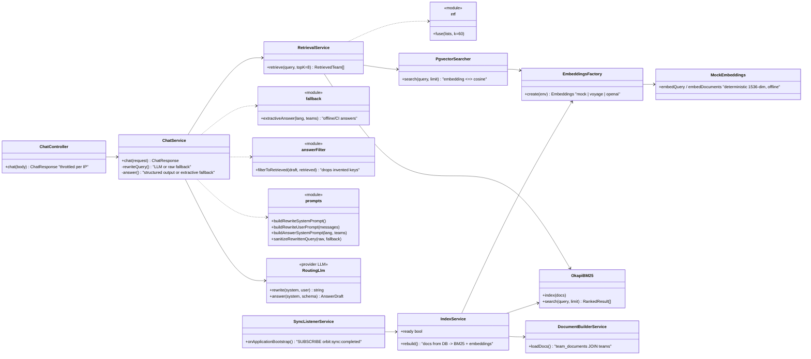

# assistant-service — core classes

The retrieval core (`retrieval/core/*` — tokenizer, BM25, RRF, cosine, doc shaping, seed loader) is framework-free on purpose: `eval/run-eval.ts` runs the exact same ranking code over `infra/db/seed/registry.json` with no DB, no Nest and no LLM.
