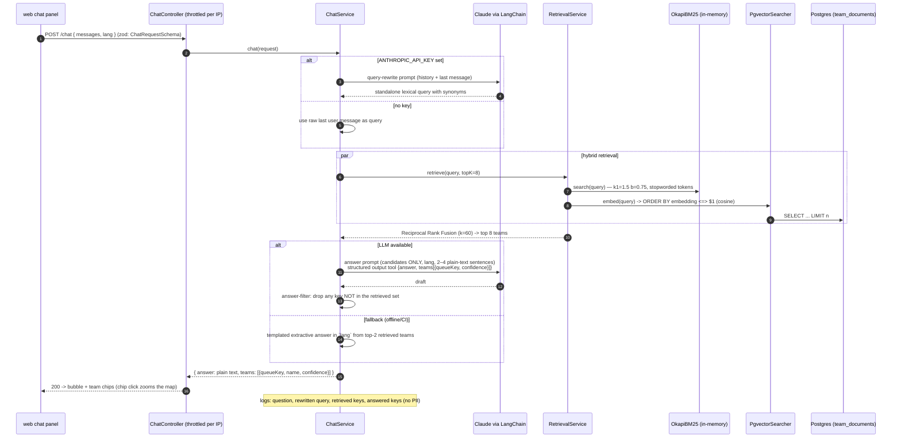

# Chat / RAG sequence (POST /chat)

Code: `apps/services/assistant-service/src/chat/chat.service.ts`, `retrieval/*`, `chat/prompts.ts`, `chat/answer-filter.ts`, `chat/fallback.ts`.

Grounding is enforced twice: the prompt scopes the model to the 8 retrieved candidates, and `answer-filter` drops any queue key the retriever did not produce — an invented key can never reach the UI.
