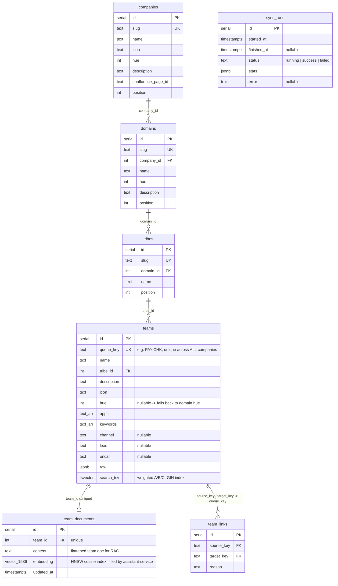

# Registry ERD

Matches `packages/shared/src/db/schema.ts` exactly (DDL: `apps/services/registry-service/src/database/migrations/0001_init.sql`).

- `search_tsv` is written in the sync transaction: `setweight(to_tsvector('simple', queue_key||' '||name),'A') || setweight(..keywords+apps..,'B') || setweight(..description..,'C')` with a GIN index.
- `team_documents.content` is rebuilt by registry-service on every sync; `embedding` is owned by assistant-service (mock/gemini provider).
