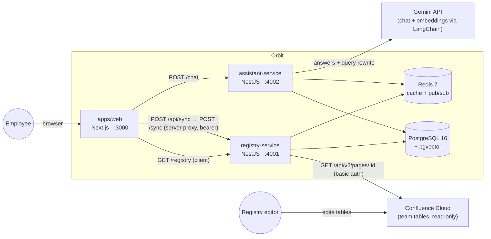
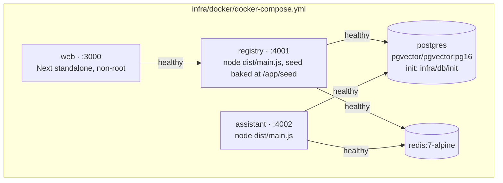

# System context & containers

## Context

- The app is **read-only**: the only mutation any user can cause is a re-sync (Refresh button). All registry edits happen in Confluence.
- `MOCK_CONFLUENCE=true` (default in dev/CI) swaps the Confluence source for the bundled seed `infra/db/seed/registry.json` — the full stack runs offline.
- Redis carries two things: the assembled snapshot cache (`orbit:registry:snapshot`) and the `orbit:sync:completed` pub/sub channel that tells assistant-service to reindex.

## Containers (docker-compose.yml)

Healthchecks gate `depends_on`; the registry migrates + boot-syncs on start, so `make docker-up` renders the seeded registry with zero manual steps. Dev variant (`docker-compose.dev.yml`) runs only postgres (host :5433) + redis (host :6380).
